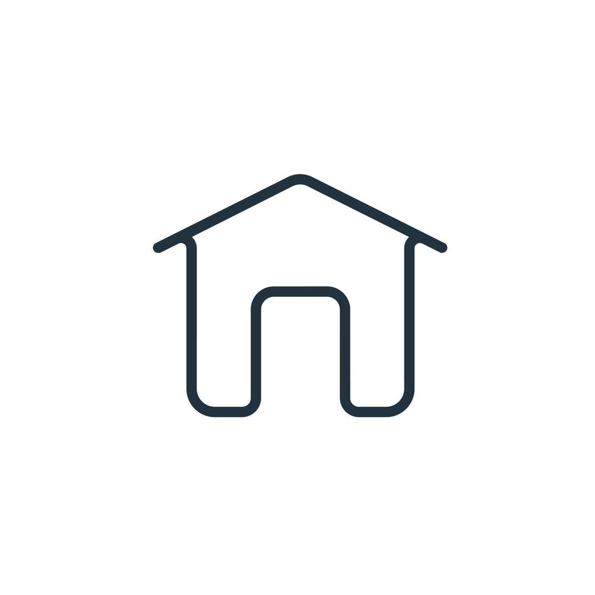
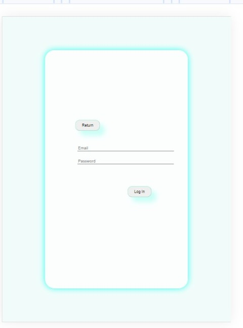
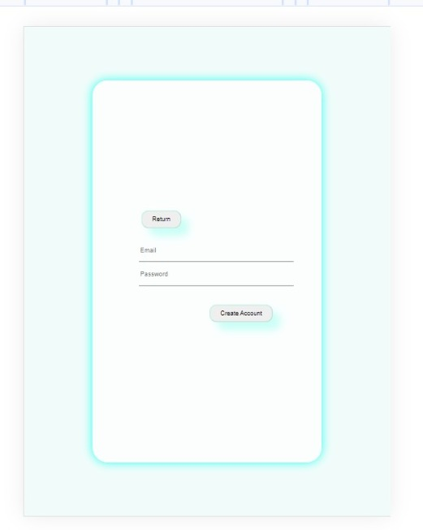
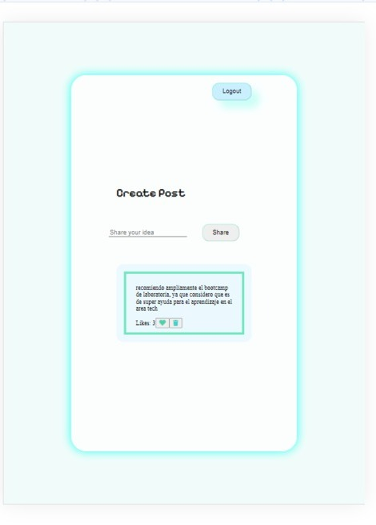

# social-network TechShare

Bienvenida a esta nueva red social TechShare
El objetivo de este proyecto tiene como proposito ser una red social en la que se puedan compartir desde dudas, memes, investigaciones, o cualquie tipo de dato que sea sobre el area de tecnologia.
En esta Red Social se permite a cualquier usuario crear una cuenta de acceso
y loguearse con ella; crear, editar, borrar y _"likear"_ publicacciones.

## Historias de usuario
Historia de Usuario-1

Yo/como: Usuario interesado en programación.
Quiero: Poder registrarme y crear una cuenta en "TechShare".
Para: Acceder a todas las funcionalidades de la plataforma y ser parte de la comunidad.

Criterios de Aceptación:

Debe haber un formulario de registro en la interfaz.
El formulario debe incluir campos para nombre de usuario, correo electrónico y contraseña.
Debe haber una opción para registrarse usando una cuenta de Google.
Después de registrarse, el usuario debe poder iniciar sesión con su cuenta.
Definición de Terminado:

El formulario de registro debe funcionar correctamente.
Los datos de usuario deben almacenarse de manera segura.
El usuario debe poder iniciar sesión después de registrarse.
Actividad

Historia de Usuario-2

Yo/como: Usuario registrado en "TechShare" o programador.
Quiero: Iniciar sesión en mi cuenta para acceder a todas las funcionalidades de la plataforma.
Para: Participar en la comunidad, publicar ejemplos de código y acceder a recursos educativos.

Criterios de Aceptación:

Debe haber un formulario de inicio de sesión en la interfaz.
El formulario debe incluir campos para correo electrónico y contraseña.
Debe haber una opción para iniciar sesión con una cuenta de Google.
Definición de Terminado:

El formulario de inicio de sesión debe funcionar correctamente.
Los usuarios deben poder acceder a sus cuentas después de iniciar sesión.

Historia de usuario-3

Yo/como: Usuario interesado en la tecnologia/programacion.
Quiero: Poder publicar mis ideas y reflexiones sobre programación en "TechShare."
Para: Compartir conocimientos, experiencias o preguntas con la comunidad y obtener retroalimentación.

Criterios de Aceptación:

Debe haber una sección en la plataforma para crear y publicar pensamientos.
Los usuarios deben poder escribir y formatear sus ideas en un editor de texto.
Las publicaciones deben incluir campos para el título y las etiquetas.
Debe haber validaciones para garantizar que se incluya contenido en la publicación.
Definición de Terminado:

Los usuarios pueden crear y publicar sus pensamientos en la plataforma.
Los pensamientos se muestran en el muro/timeline de la comunidad.

Historia de usuario-4

Yo/como: Usuario registrado en "TechShare."
Quiero: Poder interactuar con los pensamientos de otros usuarios dando "like" y editando mis propios pensamientos.
Para: Participar en discusiones, mostrar aprecio por los pensamientos de otros y mejorar mis propios pensamientos.

Criterios de Aceptación:

Los usuarios deben poder dar "like" a los pensamientos de otros usuarios.
Debe haber un sistema de comentarios en los pensamientos para permitir discusiones.
Los usuarios pueden editar sus propios pensamientos después de publicarlos.
Debe haber una confirmación antes de eliminar un pensamiento.
Definición de Terminado:

Los usuarios pueden interactuar con los pensamientos de otros usuarios dando "like" y comentando.
Los usuarios pueden editar sus propios pensamientos después de publicarlos.

Historia de usuario-5
 Yo/como: Usuario registrado en "TechShare." Quiero: Poder eliminar los post.

 Criterios de Aceptación:

Los usuarios deben poder "eliminar" a sus propios pensamientos. Debe haber un sistema de comentarios un boton en el que ellos puedan realizar esta funcion 

 Definición de Terminado:

Los usuarios pueden interactuar con sus propias publicaciones dando la opcion de eliminar si asi lo requieren.
## Diseño de interfaz
Para comenzar se realizó un prototipo de baja fidelidad 

 Se realizo un prototipo de alta fidelidad en Figma donde se muestra el funcionamiento y diseño de la página en cada una de las vistas. 
Se realizo un logo para la app

se realizo una serie de test de usuabilidad y en base a eso fuimos eligiendo el mejor diseño que se adaptara a nuestra idea
## diseño final
De acuerdo a los test de usuabilidad se decidio dejar el siguiente diseño, incluyendo la parte responsive.

"HOME"

"LOGIN"

 
"REGISTER"

"FEED"

## pruebas unitarias
se realizaron las pruebas unitarias de cada de las vistas
